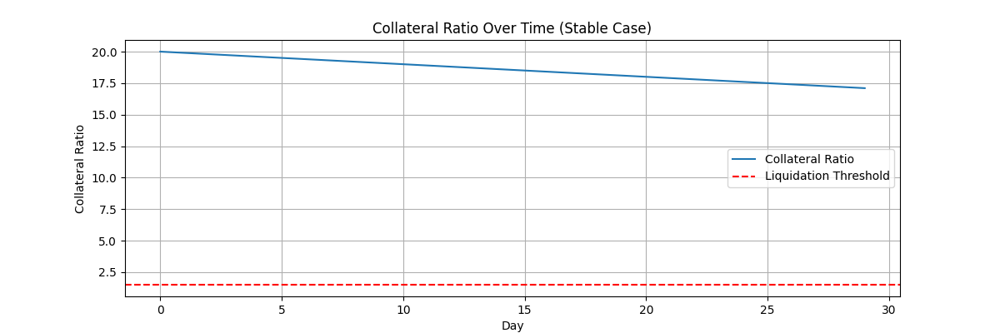
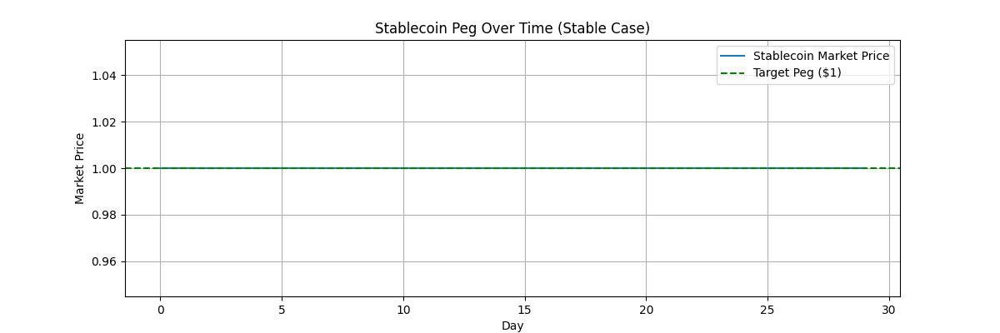
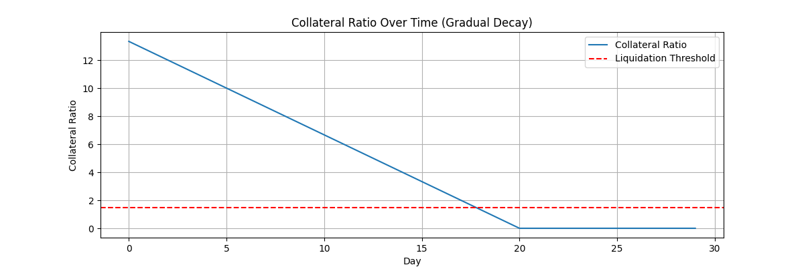
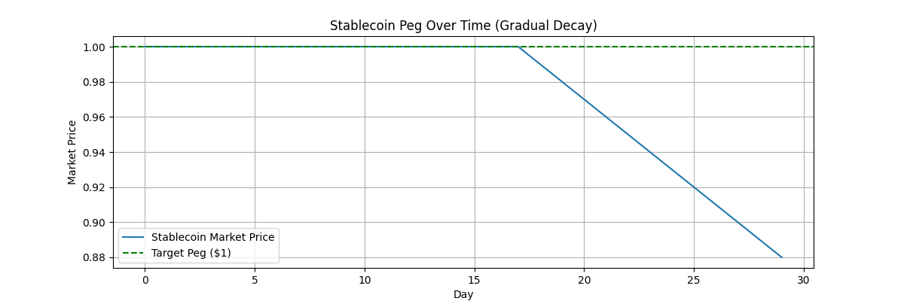
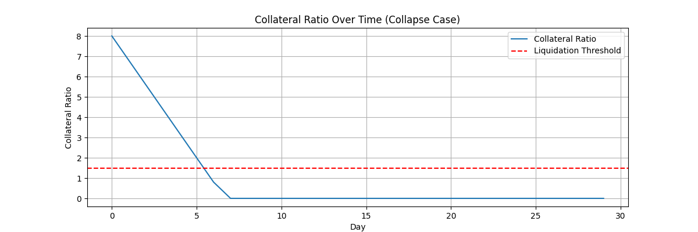
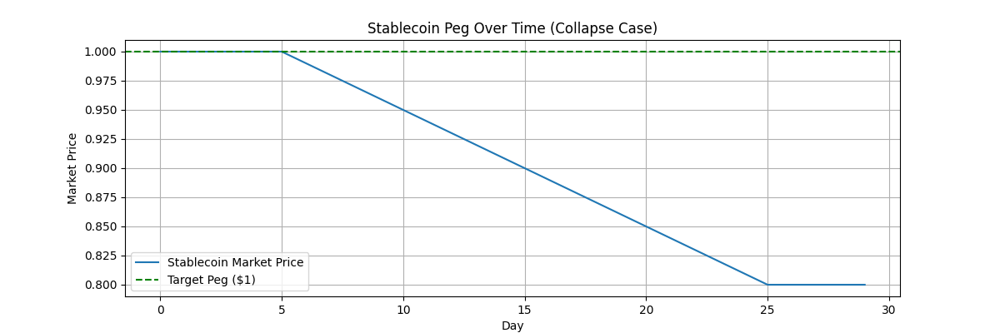

# Stablecoin Peg Simulator

This project simulates how a collateral-backed stablecoin (similar to DAI) maintains or loses its peg under various market stress scenarios. The goal is to explore how changes in collateral price, liquidation thresholds, and confidence dynamics influence peg stability — and what ultimately causes it to break.

---

## 🔍 What It Shows

Using simple Python simulations and visualizations, this model demonstrates:

- How collateral ratios evolve during collateral price drops
- When liquidation thresholds are breached
- How peg erosion begins once the system is undercollateralized
- How stablecoins can enter a fragile or collapse state depending on system parameters

---

## 📁 Scenarios Modeled

### ✅ Scenario 1: Stable Case
> Gradual price decline, no breach of liquidation threshold.  
> The peg remains stable at $1.00.

### ⚠️ Scenario 2: Gradual Decay
> Collateral ratio dips below the threshold.  
> The peg slips slowly due to loss of confidence.

### ❌ Scenario 3: Full Collapse
> Severe price crash leads to extreme undercollateralization.  
> The peg decays to a predefined floor ($0.80), simulating a crisis of confidence.

---

## Technologies Used

- Python 3
- Jupyter Notebook
- NumPy
- Matplotlib

---

## How to Run

1. Clone the repo or download the notebook:
    ```bash
    git clone https://github.com/yourusername/stablecoin-peg-sim
    cd stablecoin-peg-sim
    ```

2. Create and activate a virtual environment:
    ```bash
    python3 -m venv venv
    source venv/bin/activate
    ```

3. Install dependencies:
    ```bash
    pip install -r requirements.txt
    ```

4. Launch Jupyter:
    ```bash
    jupyter notebook
    ```

5. Open `stablecoin-peg-simulator-full.ipynb` and run all cells.

---

---

## Example Outputs

### Scenario 1: Healthy System (Stable Peg)

**Collateral Ratio:**


**Stablecoin Market Price:**


---

### Scenario 2: Gradual Decay

**Collateral Ratio:**


**Stablecoin Market Price:**


---

### Scenario 3: Full Collapse

**Collateral Ratio:**


**Stablecoin Market Price:**


---

## Key Learnings

- Overcollateralization is essential for peg stability.
- Peg decay can begin *before* the system collapses, due to early confidence loss.
- A simple threshold system can simulate cascading failure when pushed beyond design assumptions.

---

## Future Extensions

- Add arbitrageur behavior to restore the peg
- Introduce confidence scoring models
- Simulate on-chain liquidation incentives and gas cost mechanics
- Model recovery from partial collateral rebounds

---

